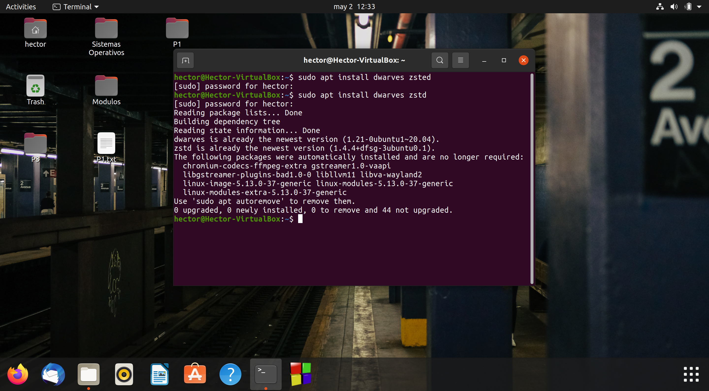
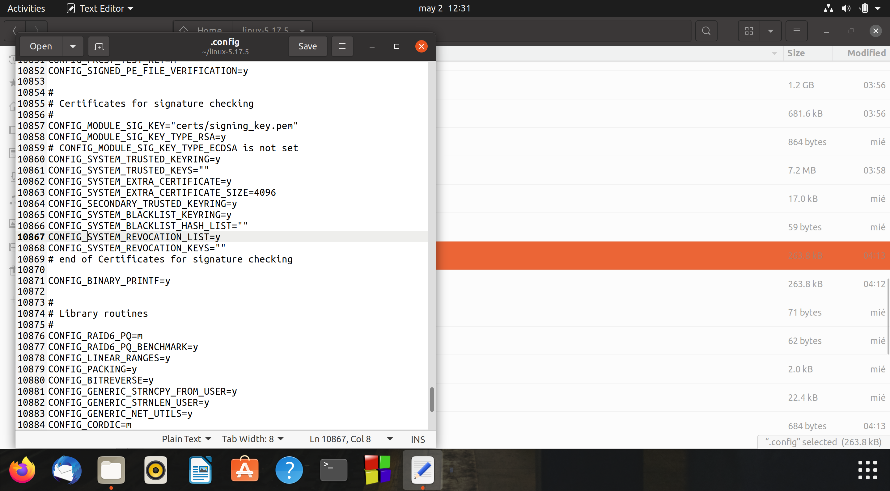
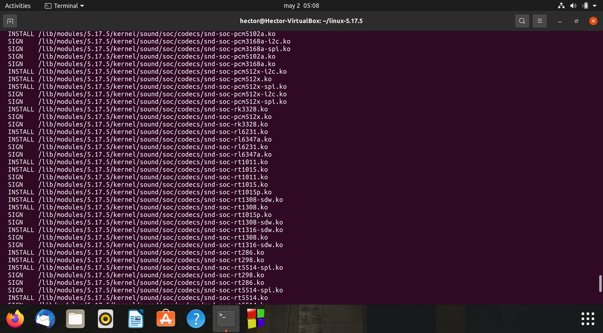
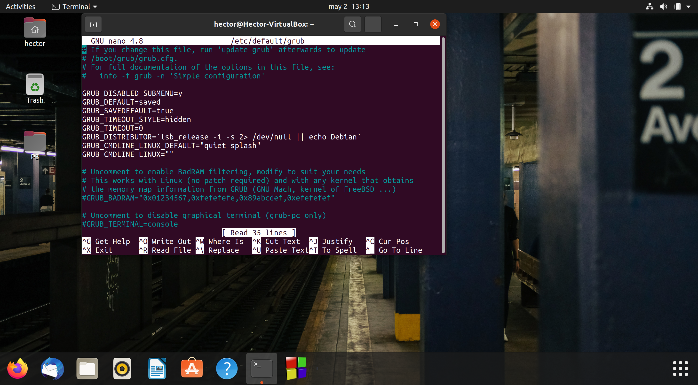
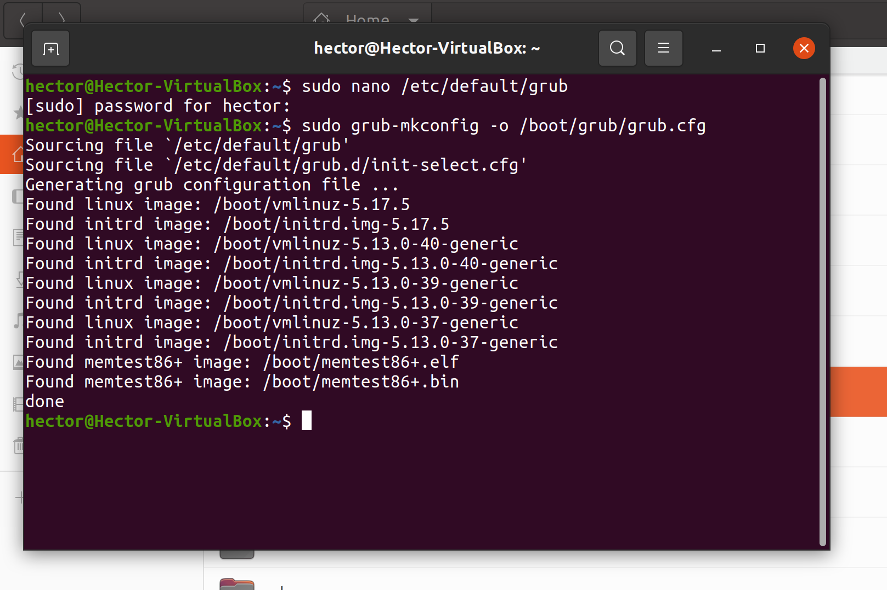
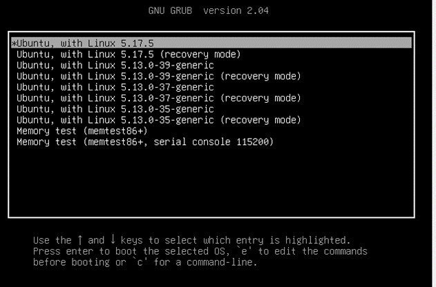
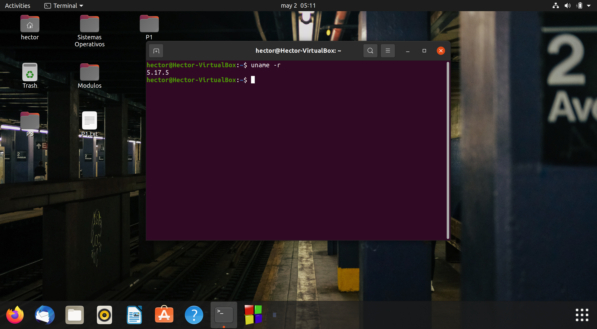

# SistemasOperativosII-P3
Repositorio de la práctica 3 de Sistemas Operativos II, la cual describe cómo compilar una versión del kernel de Linux.

## Paso 1 ¿Cómo hacer un respaldo de una máquina virtual? y ¿cómo levantar ese respaldo?

Antes de compilar el kernel, se realizará un respaldo en caso de que surja alguna falla. Para esto en el VirtualBox le daremos click derecho a la máquina virtual, y le daremos click a la opción que dice clonar. Marcaremos los dos checkboxs, y guardaremos el clon donde queramos. Le damos siguiente, y verificamos que esté marcada la opción de full clone. Le damos a clonar. Una vez hecho esto debería aparecer así el respaldo:


Captura del respaldo corriendo: 


## Paso 2 Explicar la nomenclatura del kernel.

La nomenclatura moderna para la versión del kernal de Linux consiste en:
major#.minor#[.patchlevel][-ExtraVersion]
donde patchlevel y extraversion son números opcionales.

El major number es el número principal de la versión.

El minor number es el número jerárquicamente debajo del número principal, el cual representa cambios hechos a la versión principal actual. 

El patchlevel, también llamado ABI o revisión, es aplicado a una versión estable del kernel cuando se necesitan hacer pequeñas actualizaciones de bugs o seguridad.

El extraversion es típicamente utilizado por los distribuidores de los kernels para mantener un registro de sus cambios internos. Es utilizado para manejar múltiples variantes de la misma versión de un kernel.

## Paso 3 Investigar y enlistar los paquetes requeridos para la compilación y ¿cómo instalarlos desde terminal?.

Antes de realizar la compilación del kernel es necesaria la instalación de paquetes a través de la terminal, estos paquetes son: 

-git
-fakeroot
-build-essential
-ncurses-dev
-xz-utils
-libssl-dev
-bc
-flex
-libelf-dev
-bison

Para la instalación de estos paquetes se ocupa el comando:

```
sudo apt-get install git fakeroot build-essential ncurses-dev xz-utils libssl-dev bc flex libelf-dev bison
```
Dependiendo de la versión de kernel que se quiera instalar, será necesario la instalación de otros paquetes. En este caso fue necesaria la instalación adicional de los paquetes:
-dwarves
-zstd



Capturas de la instalación de los paquetes:


## Paso 4 ¿Cómo descargar una versión de kernel desde terminal?

Para realizar este paso se utiliza el comando wget, y se le pasa el link de descarga de la versión de kernal deseada:

```
wget https://cdn.kernel.org/pub/linux/kernel/v5.x/linux-5.17.5.tar.xz
```


Captura de la descarga del kernel: 


Captura de la descarga finalizada:


## Paso 5 ¿Cómo extraer el código comprimido del kernel desde terminal?

Para descomprimir el código se utiliza el comando tar, el cual nos ayuda a comprimir y descomprimir archivos en linux:
```
tar xvf linux-5.17.5.tar.xz
```
Captura en terminal del comando: 


## Paso 6 ¿Cómo configurar el kernel?

Primero hay que moverse a la carpeta descomprimida del kernel:

```
cd linux-5.17.5
```


Después es necesario realizar una copia del archivo de configuración del kernel instalado actualmente para modificarlo con la nueva versión.
```
cp -v /boot/config-$(uname -r) .config
```


Por último, se realiza el make de menuconfig.

```
make menuconfig
```


El make construirá el menú de configuración; al terminar se abrirá la siguiente interfaz la cual sirve para modificar los parámetros del kernel. Hay que tener cuidado pues modificar algo de forma incorrecta puede resultar en una compilación errónea del kernel.


Al terminar de configurar los parámetros que se deseen, hay que ir a la opción de guardar y dejar el mismo nombre que nos indica.


## Paso 7 ¿Cómo compilar el código del kernel?

El siguiente paso es compilar el kernel, el cual puede llegar a tardar varias horas dependiendo de la velocidad del CPU de la computadora. También es indispensable tener mínimo 40 GB de espacio libre en la máquina virtual. Antes de la compilación es necesario modificar el archivo de configuración y cambiar los siguientes parámetros:



Los siguientes parámetros, en las líneas 10861 y 10868 deben quedar de la siguiente manera:

CONFIG_SYSTEM_REVOCATION_KEYS=""

SYSTEM_REVOCATION_KEYS=""

El SYSTEM_REVOCATION_KEYS también se puede deshabilitar con el siguiente comando, que se debe ejecutar estando en la carpeta del kernel:

```
scripts/config --disable SYSTEM_REVOCATION_KEYS
```
Después, para realizar la compilación se ejecuta el make estando en la carpeta del kernel:

```
make 
```
Es posible realizar la compilación con paralelismo, utilizando make con el modificador -j y después el número de procesos que queremos que se realicen en paralelo.

```
make -j 4
```
Así el comando va a realizar 4 procesos en paralelo.
Este número no debe superar el número de núcleos que se tenga en el CPU, pues puede salir contraproducente para la velocidad de la compilación.


Captura de la compilación en proceso:


Captura de la compilación terminada.


## Paso 8 ¿Cómo instalar módulos?

El siguiente paso es terminar de compilar e instalar módulos necesarios para la instalación final del kernel con el siguiente comando: 

```
sudo make modules_install
```


## Paso 9 ¿Cómo instalar el kernel?

Por último, se debe instalar el kernel una vez se ha compilado todo.

```
sudo make install 
```

Captura de la instalación en progreso: 


Al finalizar la instalación no se mostrará ningún mensaje, solo se dejará de actualizar la consola.

## Paso 10 ¿Cómo indicarle a la computadora con cuál kernel debe iniciar?

Para indicarle a Ubuntu que kernel cargar al inicio, se debe de entrar al menu GRUB, el cual nos permite elegir cual sistema operativo cargar.
Para poder cargar este menu, fue necesario realizar dos cosas antes:

1. Abrir la terminal y en la dirección de home ejecutar el comando: 
```
sudo nano /etc/default/grub
```
Esto abrirá un archivo de configuración de GRUB con el editor de texto por consola nano.

Este archivo debe de contener las primeras tres línesa de esta forma:



2. Ejecutar el comando:

```
sudo grub-mkconfig -o /boot/grub/grub.cfg
```



Una vez realizado estos dos pasos, se debe reiniciar Ubuntu y apretar la tecla shift mientras se inicia. Esto desplegará el menú GRUB a través del cual podremos seleccionar el kernel deseado para iniciar:




## Paso 11 ¿Cómo verificar el cambio de kernel a partir de consola?

Para verificar que efectivamente el kernel se cambió a otra versión, podemos utilizar el comando:
```
uname -rms
```



